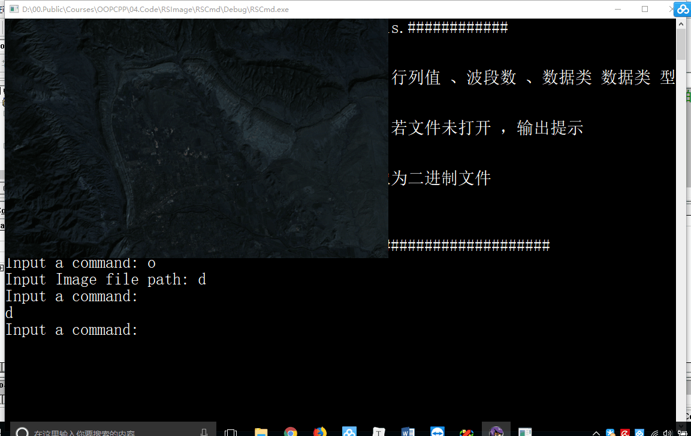

# 控制台显示图像的基本步骤

> 全部代码在main.cpp中完成

## 1. 增加头文件

```c++
include "Windows.h"	//使用窗口的函数，此头文件为WIN32系统提供的底层函数
```

## 2. 增加前向声明

```c++
// 前向声明，调用获取控制台窗口句柄
// 因为是Win32全局函数，故使用extern "C"
extern "C" HWND WINAPI GetConsoleWindow();

// 前向声明，显示图像
void DisplayImage(CRSImage* pRSImg);
```

## 3. 实现 DisplayImage函数

```c++
//////////////////////////////////////////////////////////////////////////
// DisplayImage - 显示图像到控制台窗口									//
// CRSImage* pRSImg - 图像数据指针										//
// 返回值 - void														//
//////////////////////////////////////////////////////////////////////////
void DisplayImage(CRSImage* pRSImg)
{
	// 参数判断
	if (pRSImg==NULL)
		return;
	
	HWND	hwnd = NULL;//获得句柄
	HDC		hdc = NULL;

	// 窗口句柄为NULL，返回
	hwnd = GetConsoleWindow();
	if (hwnd == NULL)
		return;

	// 设备上下文返回NULL，程序返回
	hdc = GetDC(hwnd);	
	if (hdc == NULL)
		return;

	int		i, j;	
	int		nBands = pRSImg->GetBands();		//波段
	int		nSamples = pRSImg->GetSamples();	//列
	int		nLines = pRSImg->GetLines();		//行
	unsigned char***	pppData = pRSImg->GetDataBuffer();	//三维数组头指针
	unsigned char**		ppRed = pppData[0];		//红色通道的波段
	unsigned char**		ppGrn = nBands>2 ? pppData[1] : pppData[0];	//绿色通道的波段
	unsigned char**		ppBlu = nBands>2 ? pppData[2] : pppData[0];	//蓝色通道的波段

	// 遍历像素，显示图像
	for (i=0; i<nLines; i++)
	{
		for (j=0; j<nSamples; j++)
		{	//逐个像元输出
			SetPixel(hdc,j, i, RGB(ppRed[i][j], ppGrn[i][j], ppBlu[i][j])); 	
		}
	}

	ReleaseDC(hwnd,hdc);
}
```

## 4. 调用Display函数

```c++
// 在图像文件打开之后，就可以调用图像显示
...
  case 'O':
	...
	rsImg.Open(...);
	if (rsImg.IsOpen())
		DisplayImage(&rsImg);
	break;
```

## 5. 效果

显示的效果图如下所示：

- 你若有兴趣，可以修改DisplayImage的接口，实现图像的定制化显示，如：波段组合等。